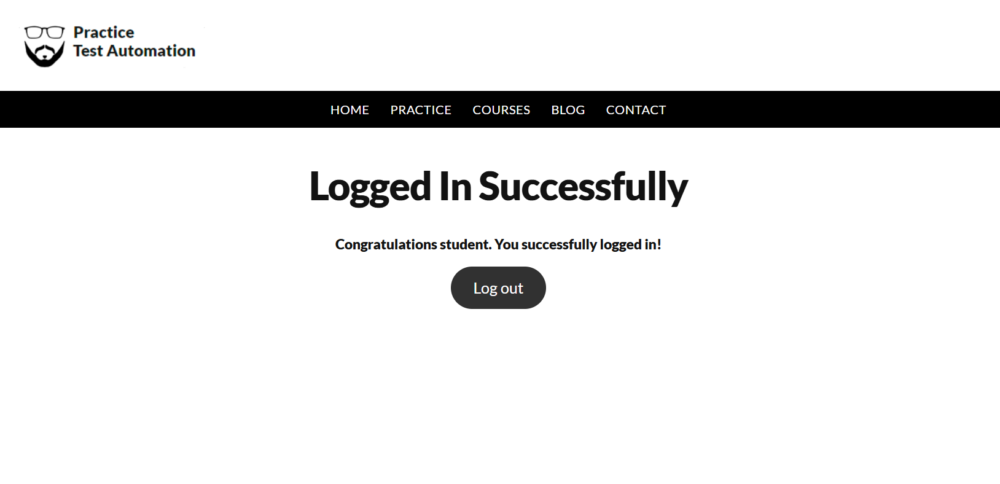
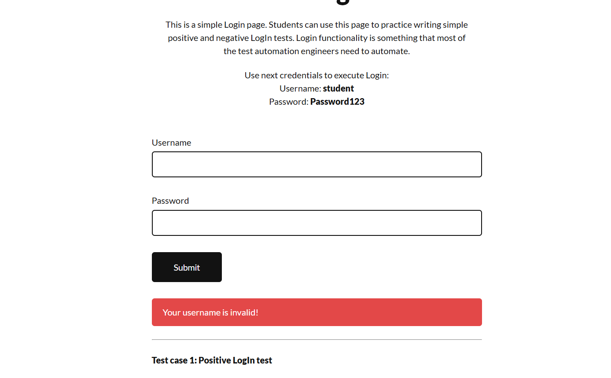
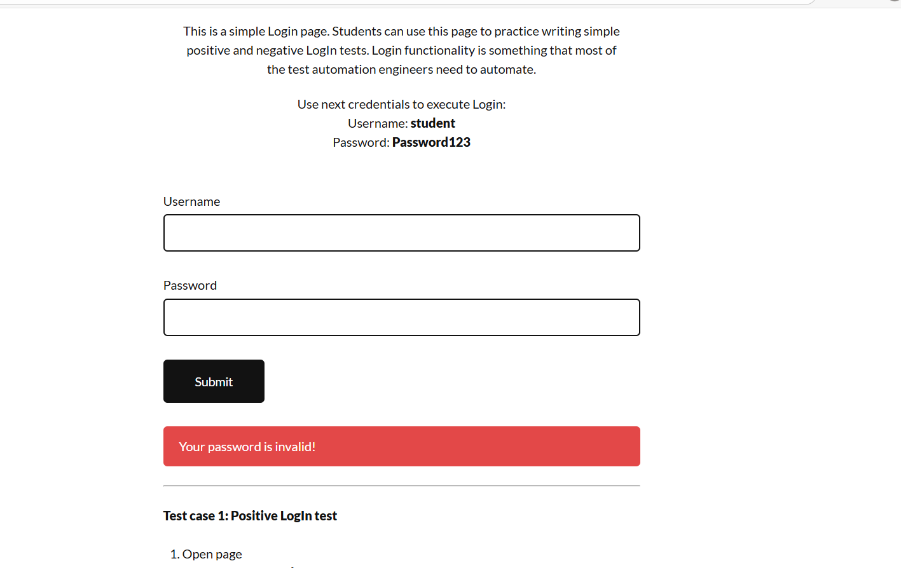

# 01 │ Selenium Basics – Login Automation  
https://practicetestautomation.com/practice-test-login/

Simple, clean and fully working login automation with positive + negative scenarios.

### What this project shows
- Selenium 4 + Python setup (webdriver-manager → no manual chromedriver)
- pytest fixture with automatic browser lifecycle
- Different locators on purpose: **By.ID**, **By.NAME**, **By.CSS_SELECTOR**, **By.XPATH**
- Positive + two negative scenarios
- Clear asserts (text + URL)

### Technologies
- Python 3.14
- Selenium WebDriver
- pytest
- webdriver-manager

### Project structure
01-login-basic/
├── tests/
│   └── test_login.py
├── screenshots/
├── requirements.txt
└── README.md

### Test scenarios
| Test                    | Username         | Password         | Expected result            | Screenshot |
|-------------------------|-----------------|-----------------|----------------------------|------------|
| Valid login            | student         | Password123     | "Logged In Successfully"  |  |
| Invalid username       | incorrectUser   | Password123     | "Your username is invalid!" |  |
| Invalid password       | student         | incorrectPassword | "Your password is invalid!" |  |

### How to run (2 commands)
```bash
pip install -r requirements.txt
pytest -v -s
