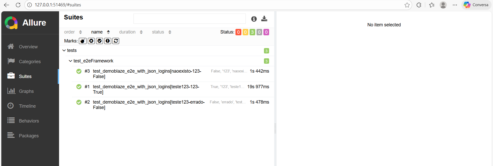

##  E2E Automation Tests

Automated end-to-end tests for the **Demoblaze** demo e-commerce website  
- https://www.demoblaze.com  

This project was developed as part of my QA Automation portfolio using **Python, Selenium, Pytest, and Allure Reports**.

The project demonstrates:

- Page Object Model (POM) design pattern  
- Data-driven testing with JSON  
- Multi-browser execution (Chrome and Firefox)  
- Complete end-to-end purchase flow  
- Automated reporting with Allure

---

## 🔧 Tech Stack

- **Language:** Python   
- **Frameworks:** Selenium WebDriver, Pytest  
- **Reporting:** Allure Reports  
- **Browsers:** Chrome, Firefox  
- **Test Data:** JSON files  


---

##  Test Scenarios

### Login
- Valid login
- Invalid login (wrong password / user does not exist)

### 🛒 E2E Flow (Valid Users)
1. Login
2. Add 3 products to cart
3. Remove 1 product
4. Place order (checkout)
5. Validate successful purchase

---
### Sample Allure Report

**Overview**

**Test Details**


## ▶ How to Run the Tests

### 1️⃣ Install dependencies
```bash
pip install -r requirements.txt
# Run tests (Chrome by default)
                                                     
pytest tests/test_e2e_demoblaze.py -v -s

# Run in Firefox
pytest --browser_name=firefox -v -s

# Generate and view Allure report
pytest --alluredir=reports -v -s
allure serve reports
